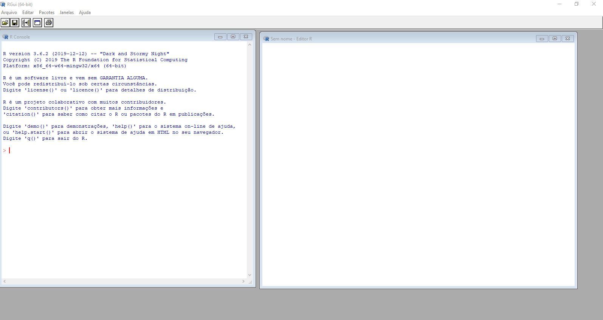
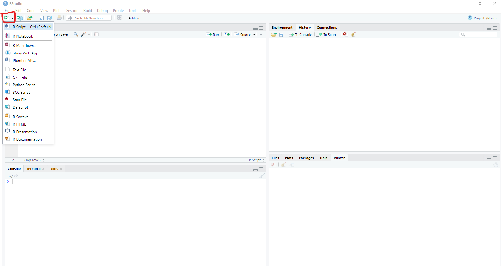
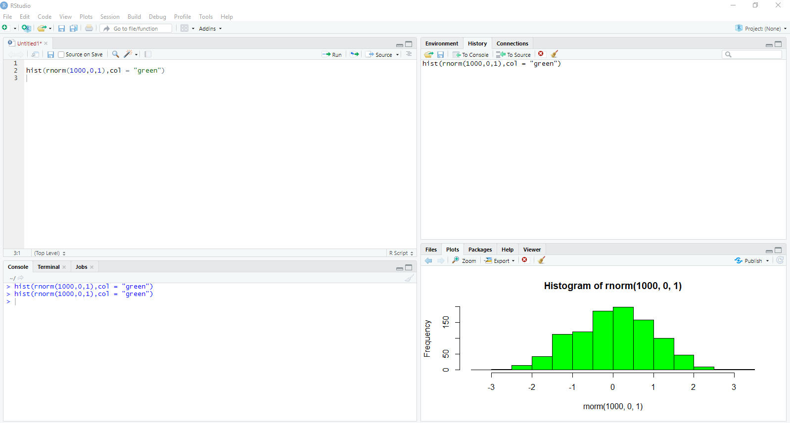
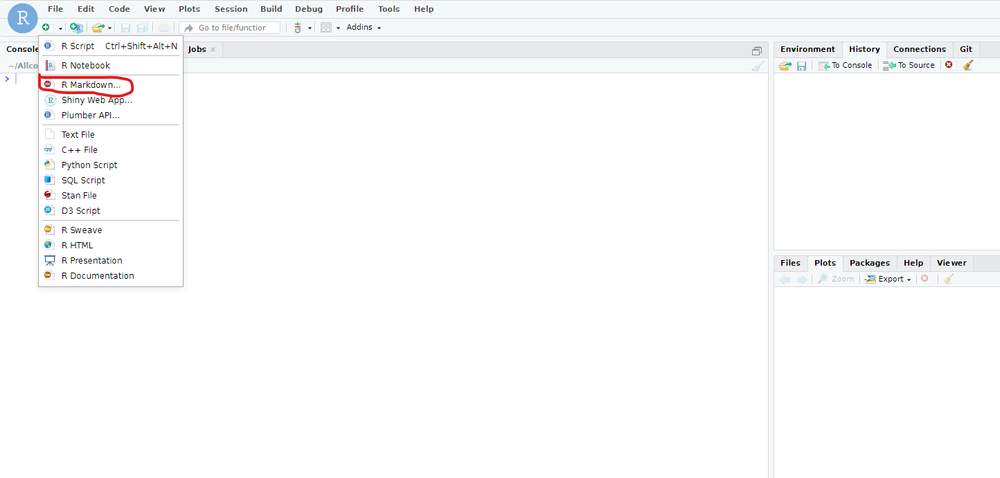
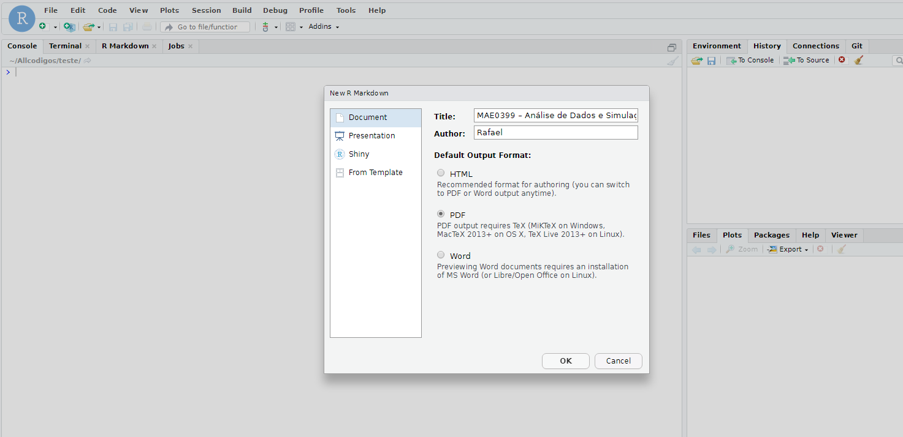
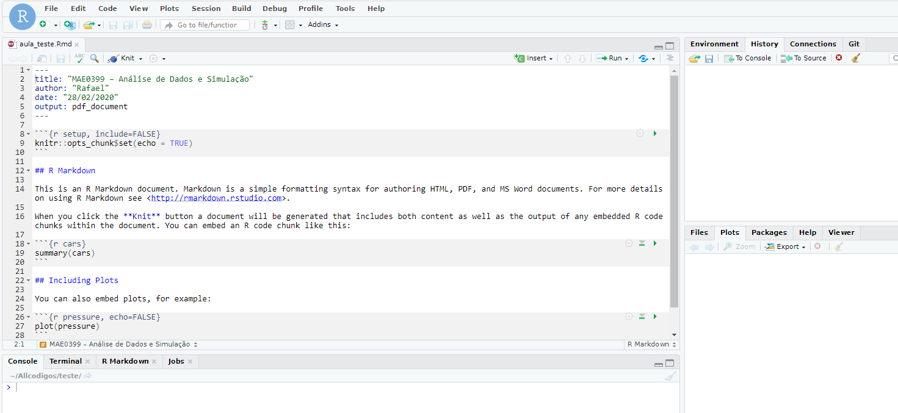
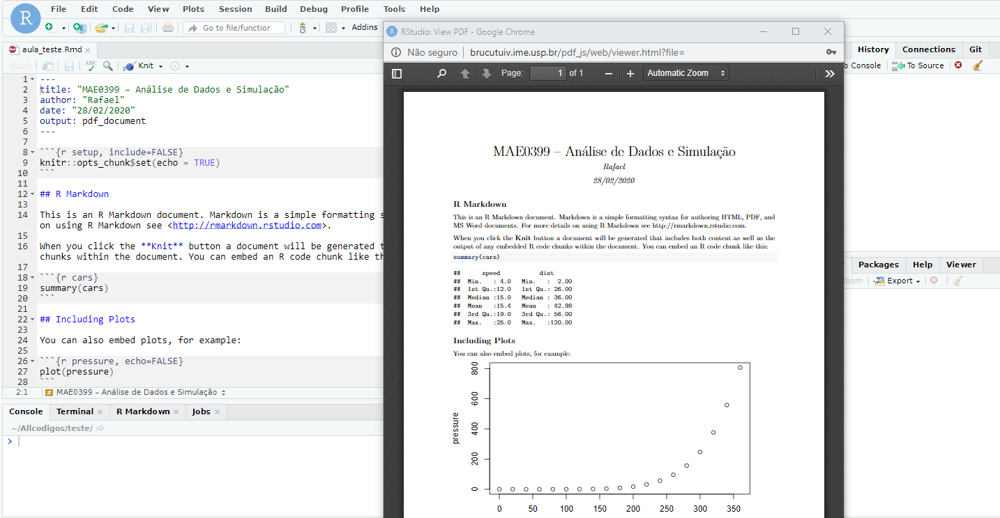

```{r setup, include=FALSE}
knitr::opts_chunk$set(echo = TRUE, size = "footnotesize")
```

## Apresentando o R

:::::: {.columns}

::: {.column width="50%"}
* \textbf{O que é o R ?}
O R é uma linguagem e ambiente voltados para estatística computacional e gráficos.
* O R foi desenvolvido por Ross Ihaka e Robert Gentleman em 1990.
```{r, echo=FALSE, fig.width=5, fig.height=4}
knitr::include_graphics("Criadores.jpg")
```
:::

::: {.column width="1%"}
\ 
<!-- an empty Div (with a whitespace), serving as
a column separator -->
:::

::: {.column width="49%"}
* Aberto e gratuito, é compatível com Windows, Linux e Mac.
* Atualmente o R está na versão \textcolor{red}{3.6.3}.
* RStudio é um Ambiente de Desenvolvimento Integrado (IDE - Integrated Development Environment) para criar e rodar o código R.
* Onde podemos baixar o R e o RStudio ?
    + <https://cran.r-project.org/>
    + <https://rstudio.com/products/rstudio/download/>
:::
::::::


## Apresentando o R

```{r , echo=FALSE, out.width = '100%'}

```

## Apresentando o RStudio

```{r , echo=FALSE,  out.width = '100%'}

```


## Apresentando o RStudio

```{r , echo=FALSE, out.width = '100%'}

```


## Apresentando o R

```{r , echo=FALSE, out.width = '100%'}

```


## Apresentando o RStudio

```{r , echo=FALSE, out.width = '100%'}

```

## Apresentando o RStudio

```{r , echo=FALSE, out.width = '100%'}

```

## Apresentando o RStudio

```{r , echo=FALSE,  out.width = '100%'}

```

## Operações Básicas no R
\scriptsize
```{r, echo = TRUE, size= "scriptsize"}
#Adição
2+2
#Subtração
2-2
#multiplicação
2*2
#Divisão
2/2
#Potenciação
2^2
```

## Funções Básicas no R
\scriptsize
```{r, echo = TRUE, size= 'scriptsize'}
#Raiz quadrada
sqrt(4)
#Logaritmo na base 10
log(2,10)
#Logaritmo na base e
log(2)
#Exponencial
exp(2)
#Fatorial
factorial(2)
```


## Funções Básicas no R
\scriptsize
```{r, echo = TRUE, size= 'scriptsize'}
#Valor absoluto
abs(-2)
#Arredondando
round(3.141516,2)
#Função Piso
floor(3.141516)
#Função teto
ceiling(3.141516)
```

## Objetos do R: vetor

\scriptsize
* Vetor
```{r , echo = TRUE, size= 'scriptsize'}
x <- c(3,1,5,4)
#Selecionando o segundo valor do vetor
x[2]
#Apagando um elemento do vetor
x[-2]
#Sequência
y <- 1:10
y
z <- seq(1,10,length = 10)
z
```


## Vetor
\scriptsize

```{r , echo = TRUE}
#Repetindo o valor 6 quatro vezes
rep(6,4)
#Repetindo o vetor quatro vezes
rep(c(1,2,3),4)
#Repetindo cada elemento do vetor quatro vezes
rep(c(1,2,3),each = 4)
#Soma dos elementos de um vetor
sum(c(1,2,3))
#Produto dos elementos de um vetor
prod(c(1,2,3))
```


## Vetor
\scriptsize
```{r , echo = TRUE}
#Comprimento de um vetor
length(c(1,2,3))
#Ordenando os elementos de um vetor de forma crescente
sort(c(4,1,6),decreasing = FALSE)
#Esta função retorna a posição dos elementos do vetor
#ordenados conforme os valores do vetor
order(c(4,1,6),decreasing = FALSE)
#Esta função retorna o máximo
max(c(1,1,2,3))
##Esta função retorna o mínimo
min(c(0,1,2,3))
```


## Matriz
\scriptsize
```{r , echo = TRUE}
M <- matrix(c(1,2,3,4),ncol = 2,nrow = 2)
M
#Selecionando os valores de uma matriz
M[1,1]
M[,1]
M[2,]
```

## Matriz
\scriptsize
```{r , echo = TRUE}
M <- matrix(0,ncol = 2,nrow = 2)
M
# Inserindo os valores em uma matriz
M[1,1] <- 1
M[2,] <- c(2,2)
M
```

## Matriz
\scriptsize
```{r , echo = TRUE}
#Matriz diagonal
M <- diag(c(1,2))
M
#Multiplicando uma matriz por outra matriz
M%*%M
#Multiplicando um matriz por um escalar
2*M
```

## Matriz
\scriptsize
```{r , echo = TRUE}
D <- matrix(c(1,2,3,4),ncol = 2,nrow = 2)
D
#Matriz transposta
t(D)
#Matriz inversa
solve(D)
```

## Funções

\scriptsize
**Criando uma função:**

nome da função <- function(argumentos)$\{$ comandos da função  $\}$

**Exemplo:** Considere uma função que retorna a média de um vetor.

```{r , echo = TRUE}

z <- c(1,3,2,5,3,6)

zbar <- function(x){ sum(x)/length(x)}
zbar(z)

mean(z)

```


## Funções do R

\scriptsize
**Operadores de comparação**

* Igualdade: ==
* Diferente: !=
* Menor: <
* Maior: >
* Menor ou igual: <=
* Maior ou igual: >=

**Operadores lógicos** E: && Ou: ||

**Condicionais**

if (Expressão teste) $\{$
declaração
$\}$ else  declaração

```{r , echo = TRUE}
x <- 3
if(x >= 1 & x <= 6){print("sim")} else {print("Não")}

```


## Funções do R - Ciclos

\scriptsize
**While**

```{r , echo = TRUE}
x <- 3
while(x < 5){ x = x + 1 ; print(x)}

```
**For**
```{r , echo = TRUE}
x <- c()
for(i in 0:4){x[i+1] <- 2*i+1}

x
```

## Pacotes no R

Como instalar um pacote no R ?

install.packages("nome do pacote")


Como carregar um pacote ?

require("nome do pacote") ou  library("nome do pacote")


## Função Sample

\scriptsize
```{r , echo = TRUE}
x <- c("Cara", "Coroa")
#lançando uma moeda
resultados <- sample(x,5,replace = T)

resultados 

table(resultados)

#Função replicate
replicate(3,sample(x,5,replace = T))
```


## Distribuições de Probabiliade no R

\scriptsize
Fazendo $Z \sim N(0,1)$, teremos que:

:::::: {.columns}

::: {.column width="50%"}
* Densidade $f(x) = \frac{1}{\sqrt{2\pi}}e^{-x^2/2}$
```{r , echo = TRUE}
x <- seq(-3,3,length = 1000)
plot(x,dnorm(x,0,1), col = "red")
```

* P(Z < 0) = 0.5
```{r , echo = TRUE}
pnorm(0,0,1)
```
:::

::: {.column width="1%"}
\ 
<!-- an empty Div (with a whitespace), serving as
a column separator -->
:::

::: {.column width="49%"}

* Mediana
```{r , echo = TRUE}
qnorm(0.5,0,1)
```
* gerando valores aleatórios
```{r , echo = TRUE}
hist(rnorm(1000,0,1), 
     freq = F, col = "green")
```

:::
::::::


## Distribuições de Probabiliade no R

* p para probabilidadde acumulada;
* q para quantil;
* d para densidade;
* r gerar uma amostra de uma distribuição.

**Simulando variáveis aleatórias no R**

* $rnorm(n,mu,sigma)$ gerando $n$ valores da distribuição Normal($\mu, \sigma$);
* $runif(n,a,b)$ gerando $n$ valores da distribuição Uniforme($a,b$);
* $rexp(n,lambda)$ gerando $n$ valores da distribuição Exponencial($\lambda$); 
* $rpois(n,lambda)$ gerando $n$ valores da distribuição Poison($\lambda$); 
* $rbinom(n,K,p)$ gerando $n$ valores da distribuição Binomial($K,p$);
* etc.


## Análise descritiva no R

\scriptsize
* Iremos trabalhar com dados simulados:
```{r , echo = TRUE}
n <- 100
x <- seq(-2,10,len = n)
y <- 10 + 2*x + rnorm(n,0,2)
z <- sample(c("s","n"), n, replace = T, prob = c(0.5,0.5))

Dados <- data.frame(x=x,y=y,z=z)

str(Dados)

Dados[1:3,]
```

## Análise descritiva no R

\scriptsize
```{r , echo = TRUE}
summary(Dados$y)

sd(Dados$y)

var(Dados$y)

table(Dados$z)

```


## Análise descritiva no R

\scriptsize
:::::: {.columns}

::: {.column width="50%"}

```{r , echo = TRUE}
plot(Dados$x,Dados$y,xlab = "x",ylab = "y")
```
:::

::: {.column width="1%"}
\ 
<!-- an empty Div (with a whitespace), serving as
a column separator -->
:::

::: {.column width="49%"}

```{r , echo = TRUE}
hist(Dados$y, freq = F)
```


:::
::::::


## Análise descritiva no R

\scriptsize
:::::: {.columns}

::: {.column width="50%"}

```{r , echo = TRUE}
require(ggplot2)

ggplot(Dados, aes(x=x,y=y)) +
  theme_bw()+
  geom_point()


```
:::

::: {.column width="1%"}
\ 
<!-- an empty Div (with a whitespace), serving as
a column separator -->
:::

::: {.column width="49%"}

```{r , echo = TRUE}
ggplot(Dados, aes(x=y)) +
  theme_bw()+
  geom_histogram(aes(y=..density..),
  colour="black", fill="white",bins = 8)
```


:::
::::::


## Análise descritiva no R

\scriptsize
:::::: {.columns}

::: {.column width="50%"}

```{r , echo = TRUE}
boxplot(Dados$y)
```
:::

::: {.column width="1%"}
\ 
<!-- an empty Div (with a whitespace), serving as
a column separator -->
:::

::: {.column width="49%"}

```{r , echo = TRUE}
boxplot(y~z,data=Dados)
```


:::
::::::


## Análise descritiva no R

\scriptsize
:::::: {.columns}

::: {.column width="50%"}

```{r , echo = TRUE}
ggplot(Dados) +
  geom_boxplot(aes(x = factor(1), y = y)) +
  xlab(" ")
```
:::

::: {.column width="1%"}
\ 
<!-- an empty Div (with a whitespace), serving as
a column separator -->
:::

::: {.column width="49%"}

```{r , echo = TRUE}
ggplot(Dados, aes(x=z, y=y)) + 
  geom_boxplot()
```


:::
::::::


## Análise descritiva no R

\scriptsize
:::::: {.columns}

::: {.column width="50%"}

```{r , echo = TRUE}
dados <- data.frame(x = sample(c("S","N"),
        100,replace = T),y = sample(
          c("baixo","Médio","Alto"),
        100,replace = T))

Tabela1 <- table(dados$x)

barplot(Tabela1)
```
:::

::: {.column width="1%"}
\ 
<!-- an empty Div (with a whitespace), serving as
a column separator -->
:::

::: {.column width="49%"}

```{r , echo = TRUE}
Tabela2 <- table(dados)

barplot(Tabela2,col=c("darkblue","red"), 
names.arg = c("baixo","Médio","Alto"),
beside=TRUE)
```


:::
::::::


## Análise descritiva no R

\scriptsize
:::::: {.columns}

::: {.column width="50%"}

```{r , echo = TRUE}
ggplot(data = data.frame(Tabela1), 
  aes(x=Var1, y=Freq)) + 
  theme_bw() +
  geom_bar(stat = "identity")
```
:::

::: {.column width="1%"}
\ 
<!-- an empty Div (with a whitespace), serving as
a column separator -->
:::

::: {.column width="49%"}

```{r , echo = TRUE}
Dado1 <-data.frame(Tabela2) 
Dado1$y <- factor(Dado1$y,levels = 
c("baixo","Médio","Alto"))
ggplot(data = Dado1 , 
  aes(x=y, y=Freq,fill=x)) + 
  theme_bw() +
  scale_fill_manual(values=
  c("darkblue","red"))+
  geom_bar(stat = "identity",
  position=position_dodge())
```


:::
::::::


## Ajustando um modelo de regressão no R


A sintaxe básica para ajustar um modelo de regressão linear no R é **lm(y~x,data)**, em que $y$ é a variável resposta e a variável $x$ é a variável explicativa.

Assim, considerando 
\scriptsize
```{r}
n <- 40
x <- seq(1,10, len = n) 
y <- 2 + 0.5*x + rnorm(n,0,1)

Dados <- data.frame(x=x,y=y)

Ajuste <- lm(y ~ x,data = Dados )

names(Ajuste)

```


## Ajustando um modelo de regressão no R

\scriptsize
```{r}

Ajuste$coefficients

Ajuste$fitted.values

sum(Ajuste$residuals)

```


## Ajustando um modelo de regressão no R

\scriptsize
```{r}

summary(Ajuste)

```


## Ajustando um modelo de regressão no R


\scriptsize
:::::: {.columns}

::: {.column width="50%"}

```{r , echo = TRUE}
plot(Dados$x ,Dados$y, 
xlab = "x", ylab = "y") 
abline(Ajuste,col = "blue")
abline(c(2,0.5),col = "red")
legend(1,7,c("Reta estimada","Reta real"),
lwd=c(5,2),  col=c("green","red"),
y.intersp=1.5)
```
:::

::: {.column width="1%"}
\ 
<!-- an empty Div (with a whitespace), serving as
a column separator -->
:::

::: {.column width="49%"}

```{r , echo = TRUE}
ggplot(Dados,aes(x=x,y=y))+
theme_bw()+ geom_point() +
geom_smooth(method = "lm", se = FALSE,
aes(colour="Reta Estimada") )+
geom_abline(aes(slope = 0.5, 
intercept = 2,  colour = "Reta Real")) +
scale_colour_manual(name="",
values=c("blue", "red"))
```


:::
::::::


## Ajustando um modelo de regressão no R

\scriptsize
```{r , echo = TRUE}
n <- 50;  x <- seq(1,10, len = n) ; z <- seq(20,40, len = n) 
y <- 0.5*x + 2*z + rnorm(n,0,2)

Dados2 <- data.frame(x=x,y=y,z=z)

Ajuste2 <- lm(y ~ x + z -1,data = Dados2 )

summary(Ajuste2)
```


## Referências

* COOKBOOK FOR R. Cookbook for R. Disponível em: <http://www.cookbook-r.com/>. 
CURSO R. Material das aulas do curso de R. Disponível em: <http://curso-r.github.io/>. 

* KABACOFF, R.I. Quick-R: Descriptives. Disponível em:
<http://www.statmethods.net/stats/descriptives.html>. 

* KABACOFF, R.I. Quick-R: Frequencies. Disponível em:
<http://www.statmethods.net/stats/frequencies.html>. 

* KABACOFF, R.I. Quick-R: Pie Charts. Disponível em:
<http://www.statmethods.net/graphs/pie.html>. 

* IQSS-HARVARD. Introduction to R Graphics with ggplot2. Disponível em:
< http://tutorials.iq.harvard.edu/R/Rgraphics/Rgraphics.html >. 

* STACK OVERFLOW. Frequent ‘r’ Questions – Stack Overflow. Disponível em:
< https://stackoverflow.com/questions/tagged/r >.

* STACK OVERFLOW EM PORTUGUÊS. Perguntas ‘r’ Mais Recentes – Stack Overflow em
Português. Disponível em: < http://pt.stackoverflow.com/questions/tagged/r >.

## Agradecimentos

\Huge
\quad \quad \quad \quad \quad Obrigado!
